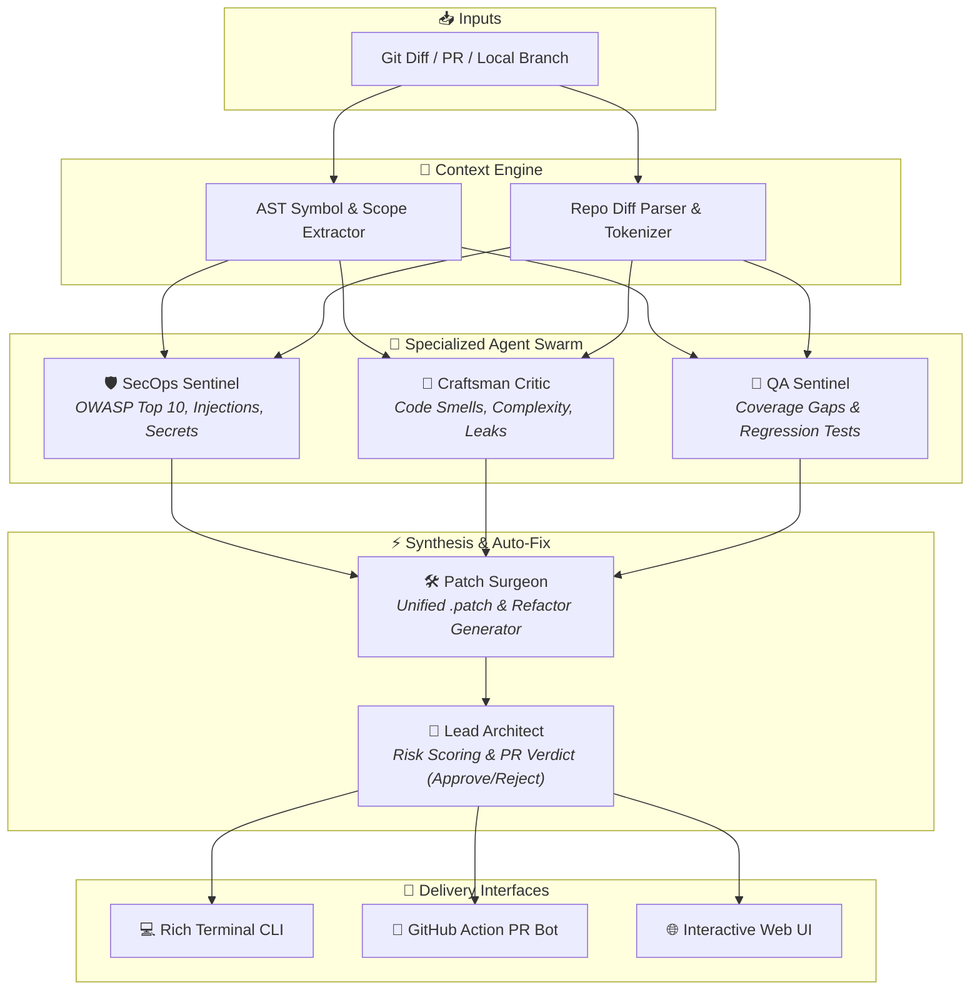

<div align="center">

# 🛡️ PR-Sentinel
### Autonomous Multi-Agent AI Code Reviewer & PR Auto-Fixer

[](https://www.python.org/downloads/)
[](https://opensource.org/licenses/MIT)
[]()
[](https://streamlit.io)
[](http://makeapullrequest.com)

**PR-Sentinel** is an open-source, multi-agent AI system that acts as your team's autonomous Principal Engineer, AppSec Auditor, and QA Specialist. It reviews pull requests, detects vulnerabilities (OWASP, secrets, injection flaws), calculates a PR risk score, synthesizes `git apply`-compatible fix patches (`.patch`), and generates missing unit tests.

</div>

---

## 🌟 Architecture & Swarm Overview

PR-Sentinel deploys a specialized swarm of focused agents rather than relying on a single generic prompt:



---

## ✨ Key Features

- **🔍 Multi-Agent Specialized Review**:
  - **🛡️ SecOps Sentinel**: Audits OWASP Top 10 vulnerabilities (SQLi, Command Injection, SSRF, XSS, Path Traversal), unencrypted secrets, and insecure deserialization with CWE mappings.
  - **🧹 Craftsman Critic**: Detects memory leaks, unclosed resource descriptors, anti-patterns, typing issues, and cyclomatic complexity bottlenecks.
  - **🧪 QA Sentinel**: Identifies unhandled edge cases and generates ready-to-run `pytest` regression tests.
  - **🛠️ Patch Surgeon**: Generates verified unified git patches (`.patch`) with 1-click interactive application.
  - **🎯 Lead Architect**: Computes unified Risk Scores (`0-100`) and final verdicts (`APPROVE`, `COMMENT`, `REQUEST_CHANGES`).
- **🔌 LLM Agnostic**: Seamlessly plug in **Google Gemini** (1.5 Pro / 1.5 Flash), **OpenAI** (GPT-4o), **Anthropic** (Claude 3.5 Sonnet), or **Local Ollama** (Qwen 2.5 Coder, Llama 3.2).
- **🖥️ 3 Interfaces in 1**:
  1. **Rich Terminal CLI** with colored syntax diffs, tables, and progress spinners.
  2. **Interactive Streamlit Web Dashboard** for visual diff reviews and patch downloads.
  3. **Ready-to-use GitHub Action** to automatically review pull requests and post inline PR comments.
- **📊 Evaluation Harness**: Built-in benchmark suite to evaluate agent precision and recall against synthetic ground-truth PRs.

---

## 🚀 Quickstart

### 1. Installation

```bash
# Clone repository
git clone https://github.com/your-username/pr-sentinel.git
cd pr-sentinel

# Create virtual environment
python3 -m venv .venv
source .venv/bin/activate

# Install package in editable mode
pip install -e .
```

### 2. Configuration

Copy the sample environment file and add your preferred API key:

```bash
cp .env.example .env
```

Edit `.env`:
```ini
LLM_MODEL=gemini/gemini-1.5-flash
GEMINI_API_KEY=your_gemini_api_key_here
# Or:
# OPENAI_API_KEY=your_openai_key
# ANTHROPIC_API_KEY=your_claude_key
```

---

## 💻 CLI Usage

### Review Local Changes
```bash
# Review unstaged changes in current git repo
pr-sentinel review

# Review staged changes
pr-sentinel review --staged

# Review against a specific base branch
pr-sentinel review --base main

# Save review output as Markdown
pr-sentinel review --output pr_report.md
```

### 🔍 Scan & Audit an Entire Repository / Folder
```bash
# Audit all code files in current directory
pr-sentinel scan

# Audit a specific repo folder with file limit
pr-sentinel scan /path/to/my-project --max-files 40 --output repo_audit.md
```

### Review Remote GitHub PR
```bash
pr-sentinel review --pr https://github.com/org/repo/pull/42 --post-comment
```

### Interactive Auto-Fix
```bash
# Interactively review and apply patches
pr-sentinel fix

# Automatically apply all generated patches
pr-sentinel fix --apply
```

### Run Built-in Vulnerable Demo Sample
```bash
pr-sentinel sample
```

---

## 🌐 Interactive Web Dashboard

Launch the local Streamlit dashboard to inspect diffs and agent reasoning visually:

```bash
streamlit run pr_sentinel/web/app.py
```

Features in Web UI:
- Paste raw diffs or fetch directly from GitHub PR URLs.
- Real-time severity filtering and auto-fix toggle.
- Tabbed breakdowns for Security, Quality, Auto-Patches, and Unit Tests.
- 1-click Download for `.patch` and Markdown reports.

---

---

## 🐙 How Any Developer Can Use This in Their Own Repo (2-Minute Setup)

Any user can install PR-Sentinel in their own GitHub repository to get automatic reviews and 1-click fixes:

### Step 1: Add the GitHub Action Workflow
Create a file at `.github/workflows/pr_sentinel.yml` in any repository:

```yaml
name: PR-Sentinel Autonomous Review & Auto-Fix Bot

on:
  pull_request:
    types: [opened, synchronize, reopened]
  issue_comment:
    types: [created]

permissions:
  contents: write
  pull-requests: write
  issues: write

jobs:
  review:
    if: github.event_name == 'pull_request' || (github.event.issue.pull_request && contains(github.event.comment.body, '/sentinel'))
    runs-on: ubuntu-latest
    steps:
      - name: Checkout Code
        uses: actions/checkout@v4
        with:
          fetch-depth: 0

      - name: Set up Python
        uses: actions/setup-python@v5
        with:
          python-version: "3.11"

      - name: Install PR-Sentinel
        run: pip install git+https://github.com/your-username/pr-sentinel.git

      - name: Run Review or Auto-Fix
        env:
          GITHUB_TOKEN: ${{ secrets.GITHUB_TOKEN }}
          GEMINI_API_KEY: ${{ secrets.GEMINI_API_KEY }}
        run: |
          if [ "${{ github.event_name }}" = "issue_comment" ] && echo "${{ github.event.comment.body }}" | grep -q "/sentinel fix"; then
            pr-sentinel bot-fix --pr "${{ github.event.issue.html_url }}"
          else
            pr-sentinel review --pr "${{ github.event.pull_request.html_url || github.event.issue.html_url }}" --post-comment
          fi
```

### Step 2: Add API Key Secret
Add `GEMINI_API_KEY` (or `OPENAI_API_KEY`) to **Settings ➔ Secrets and variables ➔ Actions**.

### Step 3: Enjoy Autonomous Reviews & 1-Click Fixes!
- Whenever a PR is opened, PR-Sentinel automatically posts the full review with detected bugs and suggested fixes.
- If the author wants the bot to auto-fix the code, they simply comment **`/sentinel fix`** on the PR!
- PR-Sentinel will immediately commit and push the fixed patch directly to their PR branch.


---

## 📊 Benchmark & Evaluation Suite

PR-Sentinel comes with an evaluation harness in `eval/` with ground-truth test cases (SQL injections, resource leaks, race conditions, clean PRs).

To run the benchmarks:

```bash
python eval/run_benchmarks.py
```

---

## 🧪 Running Unit Tests

```bash
pytest tests/ -v
```

---

## 📂 Project Structure

```
pr-sentinel/
├── pr_sentinel/
│   ├── cli.py                     # Typer + Rich Terminal UI
│   ├── config.py                  # Pydantic configuration & environment settings
│   ├── core/
│   │   ├── git_provider.py        # Git repo, patch applying & GitHub API wrapper
│   │   ├── diff_parser.py         # Unified diff parser & tokenizer
│   │   ├── ast_analyzer.py        # Python & multilingual AST context extractor
│   │   └── models.py              # Pydantic schemas (PRReviewReport, CodeIssue, Patch)
│   ├── agents/
│   │   ├── base_agent.py          # Abstract agent with schema validation
│   │   ├── security_agent.py      # AppSec, OWASP Top 10 & secrets auditor
│   │   ├── quality_agent.py       # Code smells, complexity & perf critic
│   │   ├── test_agent.py          # QA & regression test generator
│   │   ├── fixer_agent.py         # Auto-patch & refactoring synthesizer
│   │   └── lead_reviewer.py       # Orchestrator & PR synthesizer
│   ├── llm/
│   │   └── client.py              # Unified LLM provider client (LiteLLM)
│   └── web/
│       └── app.py                 # Streamlit interactive web application
├── eval/
│   ├── run_benchmarks.py          # Benchmark runner against synthetic PRs
│   └── test_cases/                # Ground-truth test suite
├── tests/                         # Pytest unit tests
├── .github/workflows/             # CI/CD & reusable PR reviewer action
├── Dockerfile                     # Docker container configuration
├── pyproject.toml                 # Package metadata
└── requirements.txt               # Dependencies
```

---

## 📄 License

This project is licensed under the MIT License - see the [LICENSE](LICENSE) file for details.
